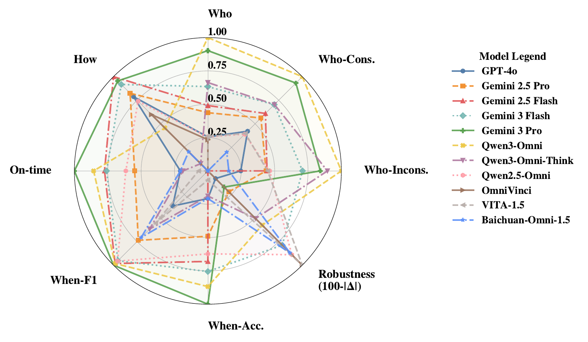

# SocialOmni: Benchmarking Audio-Visual Social Interactivity in Omni Models

<p align="center">
  
</p>

<h2 align="center">SocialOmni: Benchmarking Audio-Visual Social Interactivity in Omni Models</h2>
<h5 align="center">A benchmark for evaluating <i>who</i>, <i>when</i>, and <i>how</i> in omni-modal dialogue interaction.</h5>

<p align="center">
  <a href="https://github.com/Alexisxty/SocialOmni"></a>
  <a href="https://huggingface.co/datasets/alexisty/SocialOmni"></a>
  
  
  
</p>

<p align="center">
  <a href="#-highlights">Highlights</a> ·
  <a href="#-benchmark-overview">Benchmark Overview</a> ·
  <a href="#-quick-start">Quick Start</a> ·
  <a href="#-main-results">Main Results</a> ·
  <a href="#-citation">Citation</a>
</p>

SocialOmni is a benchmark for **audio-visual social interactivity** in omni-modal large language models (OLMs). Instead of reducing evaluation to static answer correctness, SocialOmni measures whether a model can behave appropriately in real dialogue by jointly evaluating three tightly coupled dimensions:

- **Who** is speaking: speaker separation and identification
- **When** to enter: interruption timing control
- **How** to respond: natural interruption generation

The repository contains the benchmark pipeline, model clients and servers, runtime configurations, and reproducible evaluation entrypoints for both perception and interaction-generation settings.

## 😮 Highlights

### 1. A benchmark for social interaction, not just static understanding

Existing omni-model benchmarks are still dominated by static QA and answer-centric metrics. SocialOmni instead evaluates whether a model can maintain socially appropriate behavior in multi-party dialogue, where a correct answer can still fail because of poor timing or unnatural continuation.

### 2. A unified who-when-how evaluation protocol

SocialOmni operationalizes conversational interactivity as a joint profile:

- **Who**: can the model identify the active speaker at the target timestamp?
- **When**: can the model decide whether interruption is socially appropriate?
- **How**: can the model produce a natural, contextually coherent interruption?

This design exposes cases where strong perception does not translate into strong interaction quality.

### 3. Interaction failures are measured jointly across perception and generation

The benchmark explicitly measures:

- perception robustness under audio-visual consistency and inconsistency
- timing precision / recall / F1 under tolerance windows
- judge-based quality for generated interruptions
- cross-axis decoupling between perception, timing, and response quality

<p align="center">
  
</p>

## 🔍 Benchmark Overview

<p align="center">
  
</p>

### Dataset at a glance

- **2,209** total benchmark items
- **2,000** perception samples for speaker identification
- **209** interaction-generation samples for interruption timing and response generation
- **15** dialogue subdomains spanning entertainment, professional, daily life, and narrative scenes
- Controlled **audio-visual consistent / inconsistent** splits for robustness analysis

## 🧩 Tasks

### Task I: Perception (`who`)

Given a video clip and a timestamp `t`, the model answers:

> At timestamp `t`, who is speaking?

The model chooses from `{A, B, C, D}`.

### Task II: Interaction Generation (`when` + `how`)

Given a video prefix `V[0:t]` and a candidate speaker `X`, the model performs two sub-questions:

- **Q1 (`when`)**: should `X` interrupt immediately after `t`?
- **Q2 (`how`)**: if yes, what is the natural interruption content?

## 📏 Evaluation Protocol

### Perception metrics

- Top-1 Accuracy
- Consistent / inconsistent split accuracy
- Gap:

```text
Δ = Acc_consistent - Acc_inconsistent
```

### Generation metrics

- **Q1**: Accuracy / Precision / Recall / F1 under tolerance windows such as `δ = 0.2s`
- **Q2**: LLM-judge score on `{0, 25, 50, 75, 100}`

The paper protocol uses three judges for Q2:

- GPT-4o
- Gemini 3 Pro
- Qwen3-Omni

## 🐳 Main Results

### SocialOmni reveals cross-axis decoupling

Perception strength does not guarantee interaction quality. Some models identify speakers well but perform poorly on natural interruption generation, while others generate plausible responses despite weak speaker grounding.

| Model | Who (%) | When Acc. (%) | How (/100) |
|---|---:|---:|---:|
| GPT-4o | 36.75 | 46.89 | 69.64 |
| Gemini 2.5 Pro | 44.69 | 55.67 | 72.32 |
| Gemini 2.5 Flash | 47.03 | 61.50 | **85.08** |
| Gemini 3 Flash Preview | 53.23 | 61.06 | 79.08 |
| Gemini 3 Pro Preview | 64.99 | **67.31** | 81.77 |
| Qwen3-Omni | **69.25** | 63.64 | 45.57 |

Key observation:

- **Who leader**: Qwen3-Omni
- **When leader**: Gemini 3 Pro Preview
- **How leader**: Gemini 2.5 Flash

This rank inversion is why SocialOmni evaluates the full interaction profile instead of a single aggregate score.

## ⚙️ Requirements and Installation

We recommend the following environment:

- Python `>=3.10,<3.11`
- CUDA-compatible PyTorch runtime for local omni models
- `uv` for dependency and environment management

Install with:

```bash
git clone https://github.com/Alexisxty/SocialOmni.git
cd SocialOmni
uv sync
```

## 🚀 Quick Start

### 1. Configure runtime and paths

Edit `config/config.yaml` and set:

- API keys / API endpoints
- local model path or `server_url`
- dataset path
- output and result directories

Common environment variables:

- `OPENAI_API_KEY`
- `OPENAI_API_BASE`
- `GEMINI_API_KEY`
- `GEMINI_API_BASE`

### 2. Start a local model server

Example:

```bash
uv run models/model_server/qwen3_omni/qwen3_omni_server.py
```

Other model server entrypoints are located under:

```text
models/model_server/*/*_server.py
```

### 3. Run Task I benchmark

```bash
uv run run_benchmark.py --model qwen3_omni
```

### 4. Run Task II benchmark

```bash
uv run run_benchmark_level2.py --model qwen3_omni --resume
```

## 🧱 Repository Structure

```text
SocialOmni/
├── config/                  # runtime, model, and evaluation configs
├── data/                    # local datasets (not tracked)
├── docs/                    # docs and visual assets
├── models/                  # model servers, clients, and shared benchmark logic
├── scripts/                 # utility scripts
├── run_benchmark.py         # Task I entrypoint
├── run_benchmark_level2.py  # Task II entrypoint
├── pyproject.toml           # dependency definition
└── README.md
```

## 🔑 Supported Model Keys

Use the following keys with `--model`:

```text
gpt4o
gemini_2_5_flash
gemini_2_5_pro
gemini_3_flash_preview
gemini_3_pro_preview
qwen3_omni
qwen3_omni_thinking
qwen2_5_omni
miniomni_2
omnivinci
vita_1_5
baichuan_omni_1_5
ming
```

## 🧪 Reproducibility Notes

- Keep dataset and result directories local and out of version control.
- Use fixed prompt templates and stable runtime configs for cross-model comparison.
- Report split-wise metrics and confidence intervals when claiming improvements.
- For generation evaluation, keep the judge set fixed across runs.

## ✏️ Citation

If you find SocialOmni useful in your research, please cite:

```bibtex
@misc{socialomni,
  title={SocialOmni: Benchmarking Audio-Visual Social Interactivity in Omni Models},
  author={Tianyu Xie and Jinfa Huang and Yuexiao Ma and Rongfang Luo and Yan Yang and Wang Chen and Yuhui Zeng and Ruize Fang and Yixuan Zou and Xiawu Zheng and Jiebo Luo and Rongrong Ji}
}
```
